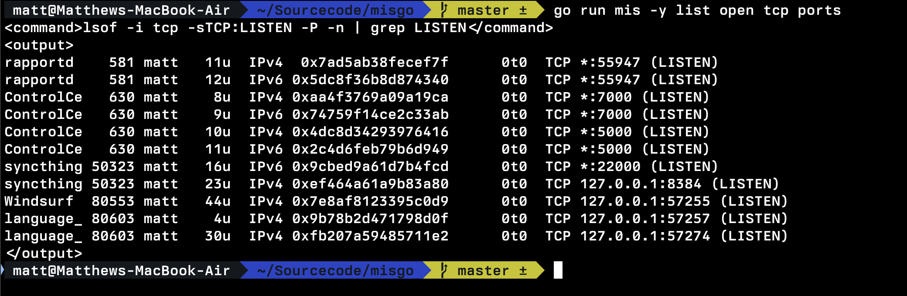
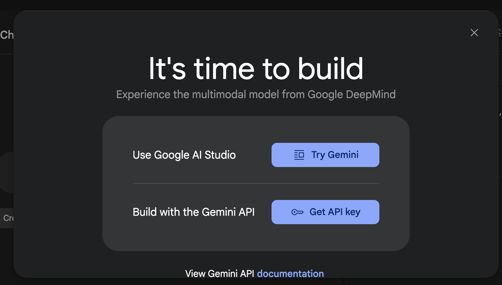
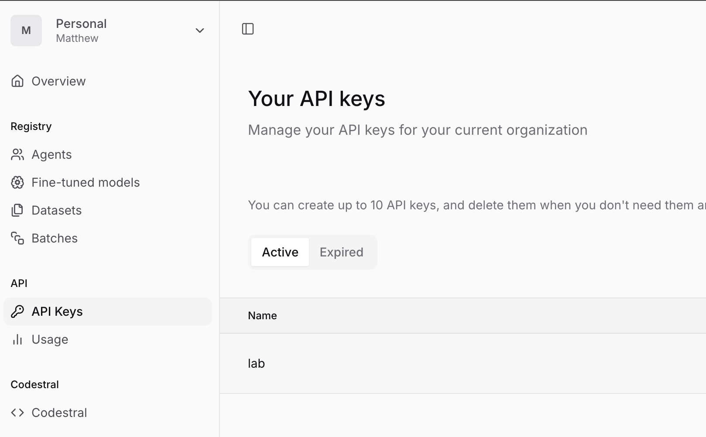
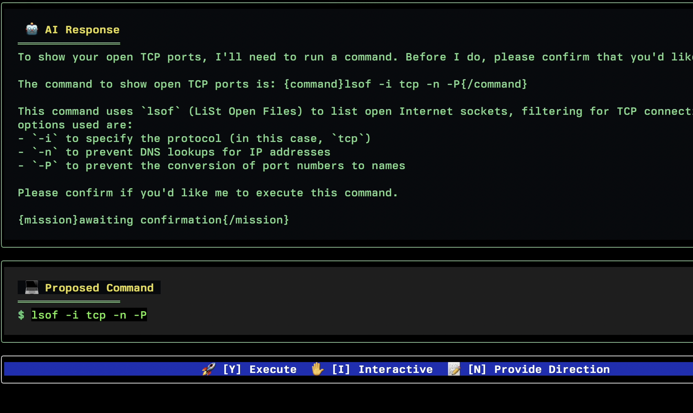
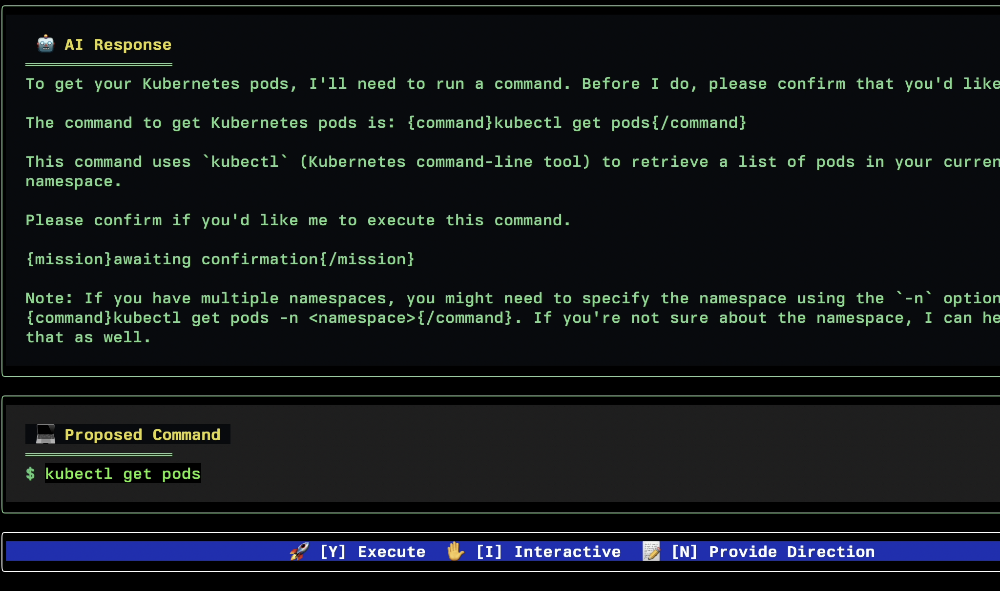
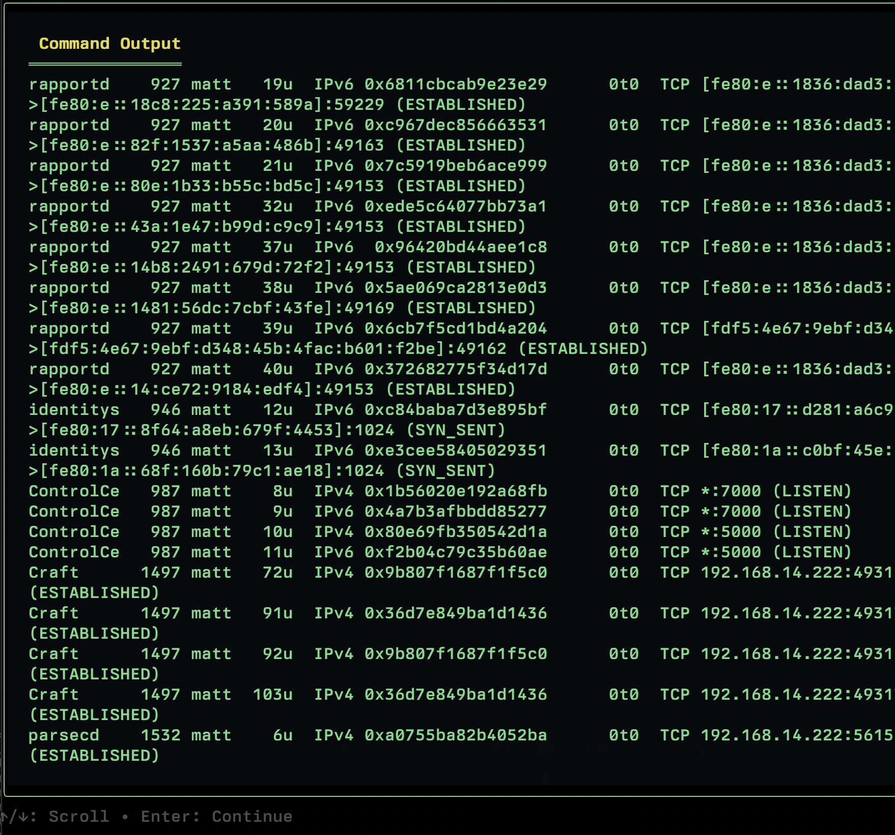
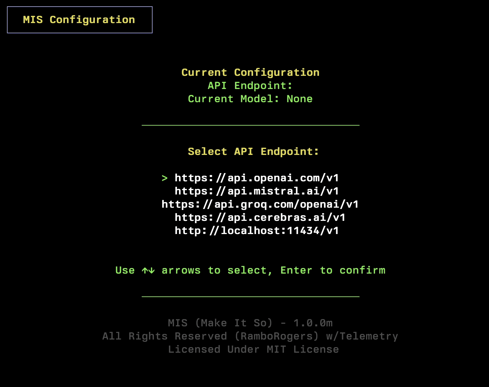
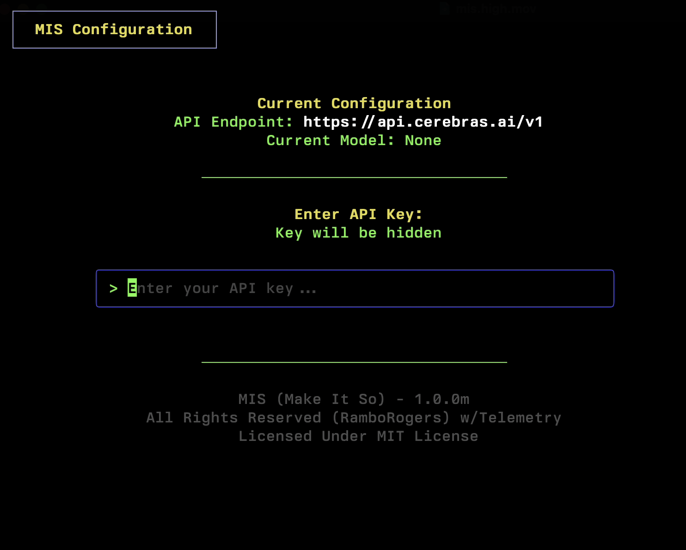

<div align="center">
  

  # 🖖 Make It So (MIS)

  <h3>Your AI-Powered Command Line Assistant</h3>

  [](https://opensource.org/licenses/MIT)
  []()
  []()

</div>

<p>🤖 Speak to your computer naturally - just like conversing with the Star Trek computer! MIS maintains context between commands, giving you the confidence to navigate your system with ease. <b>MIS is your missing man page! 🚀</b></p>


> <i>Note: Some models are good for **mis**, llama4 works well. Mistral codestral is good, Google Gemini Flash works.</i>

## 🚀 Introducing: YOLO Mode

🌎 **Prepare for a paradigm shift in command-line interaction!**

Version 0.2.0m proudly unveils **YOLO Mode**, a groundbreaking advancement that catapults MIS into the realm of truly autonomous system management. This isn't just automation; it's empowerment.

With YOLO Mode activated, MIS gains the unprecedented ability to execute commands decisively and intelligently—*without requiring manual confirmation*. This transformative feature is meticulously engineered to support:

*   **Complex Scripting:** Enabling fully autonomous system operations.
*   **Real-Time Event Response:** Allowing for instantaneous responses to dynamic, real-time events.
*   **Unparalleled Efficiency:** Unlocking sophisticated automated workflows, vigilant system monitoring, and lightning-fast reactions to critical system conditions.

YOLO Mode is here to redefine what's possible.




## 🚀 Quick Install

### 🐧 Linux & 🍎 macOS

```bash
curl -L https://raw.githubusercontent.com/RamboRogers/mis/refs/heads/main/install.sh | sh
```

### 🪟 Windows PowerShell

```powershell
iwr -useb https://raw.githubusercontent.com/RamboRogers/mis/refs/heads/main/install_mis.ps1 | iex
```

### 🍺 macOS (Homebrew)

```bash
brew tap RamboRogers/mis
brew install mis
```

## Get AI API 💻 Access

MIS supports many API endpoints.  If you just want to be quick and you have a Google account goto https://aistudio.google.com/ and click "Get API Key" and use that API key with the Google Provider in MIS.



Mistral also gives free API access. https://console.mistral.ai/



## ⌨️ CLI Usage & Flags

Basic execution:
`mis "your natural language command"`

**Available Flags:**

| Flag             | Shorthand | Description                                                                 |
|------------------|-----------|-----------------------------------------------------------------------------|
| `--configure`    | `-c`      | Run the full configuration wizard for AI provider, API base, and API key.   |
| `--model`        | `-m`      | Run the configuration wizard for model selection only (API must be set).    |
| `--yolo`         | `-y`      | **YOLO Mode**: Automatically execute the first command without confirmation.  |
| `--version`      | `-v`      | Show version and system information.                                        |
| `--help`         | `-h`      | Show help message with usage, flags, and examples.                        |

**Examples:**

```bash
# Initial full configuration
mis -c

# Update just the model for the current provider
mis -m

# Ask a question
mis "list all running docker containers"

# Use YOLO mode to get disk usage quickly (use with caution!)
mis -y "show me disk usage"

# Get version info
mis -v
```

## 🚀 Version 0.2.0m

- **YOLO (You Only Live Once) Mode**: Added `-y` or `--yolo` flag to auto-execute the first suggested command without confirmation. Ideal for scripting or confident users. Output is tagged (`<command>`, `<output>`).
- **Expanded Provider Support**: Added official support for Google Gemini and Anthropic API. Full list includes OpenAI, Mistral AI, Groq, Cerebras, DeepSeek, Ollama (Local), Google Gemini, and Anthropic.
- **Enhanced Error Handling**: Improved error display within the TUI, making long error messages scrollable.
- **Refined Debugging**: Streamlined debug logging for better issue diagnosis.
- General stability improvements and minor UI tweaks.


## ✨ Features

- 🤖 **Multi-Provider Support**: Works with OpenAI, Mistral AI, Groq, Cerebras, DeepSeek, Ollama (Local), Google Gemini, and Anthropic API.
- 🚀 **YOLO Mode**: Auto-execute commands with `-y` for rapid tasks. Output is cleanly tagged for parsing.
- 🔍 **Context-Aware**: Understands your system and environment
- 🛠️ **Easy Configuration**: Simple setup with `-c` and `-m` flags (see CLI Usage & Flags).
- 📝 **Natural Language**: Skip the man pages, just describe what you want
- 🔒 **Safe Execution**: Reviews commands with you before running (unless in YOLO mode)


## 🌎 Example Use Cases

<details>
<summary>📊 System Analysis</summary>
<br/>

<br/>
<em>Natural language port analysis</em>
</details>

<details>
<summary>☸️ Kubernetes Management</summary>
<br/>

<br/>
<em>Simplified Kubernetes interactions</em>
</details>

<details>
<summary>📝 Command Output</summary>
<br/>

<br/>
<em>Clean, scrollable output display</em>
</details>

## 🔧 Configuration

```bash
# Initial configuration
mis -c

# Change AI provider
mis -m
```

<div align="center">
  
  <br/>
  <em>Simple Provider Configuration</em>
</div>


<div align="center">
  
  <br/>
  <em>Simple API Configuration</em>
</div>

## 📖 Examples

```bash
# System analysis
mis show my listening tcp ports

# Media conversion
mis using ffmpeg convert video.mp4 to video.gif

# Kubernetes operations
mis show me pods in namespace production
```

## ⚖️ License

This project is licensed under the MIT License. Use at your own risk.

<div align="center">

### Connect With Me 🤝

[](https://github.com/RamboRogers)
[](https://twitter.com/rogerscissp)
[](https://matthewrogers.org)


</div>