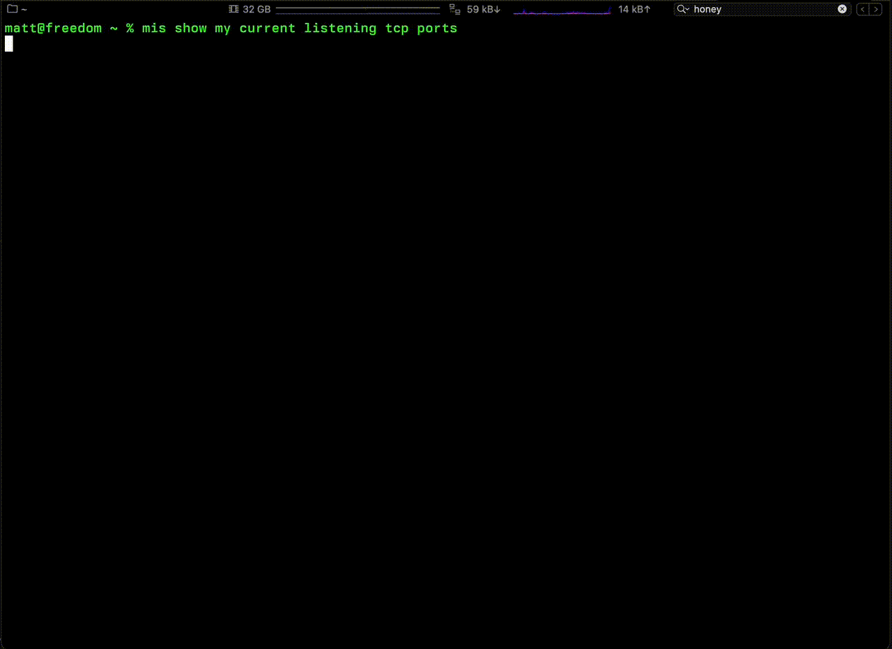
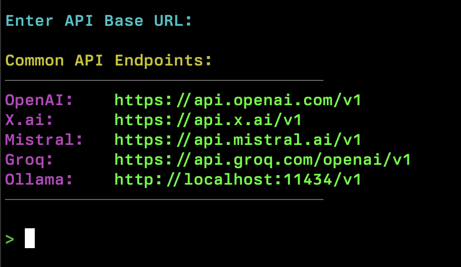
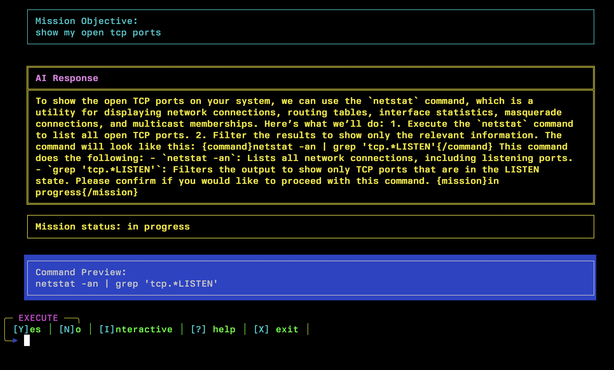
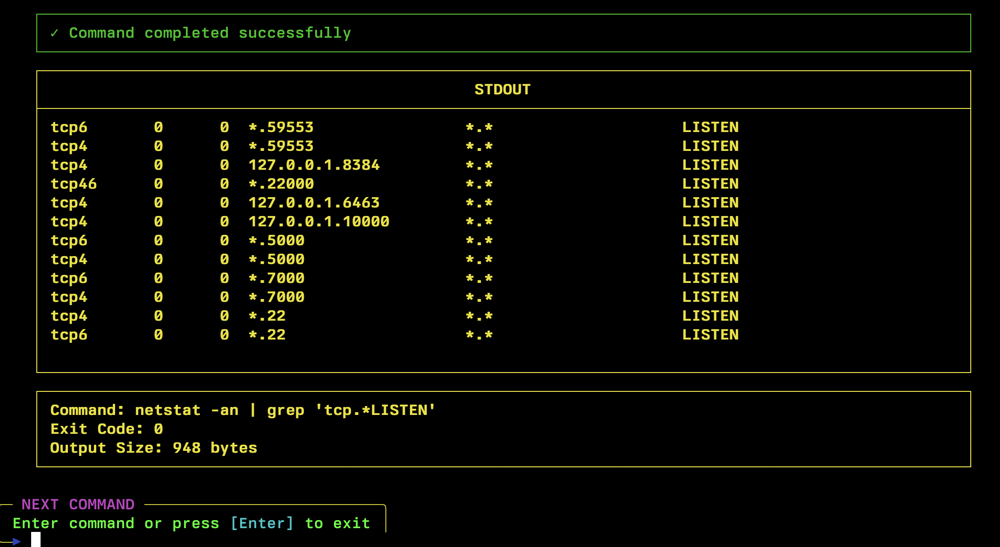
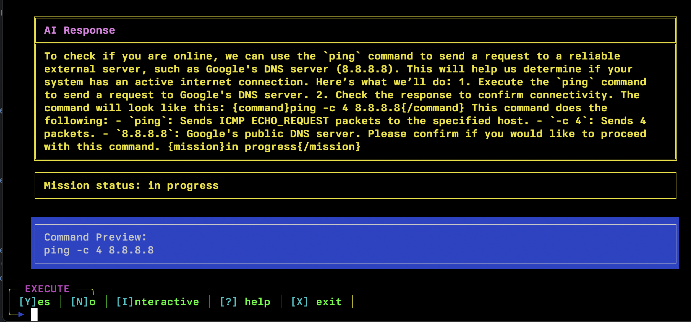
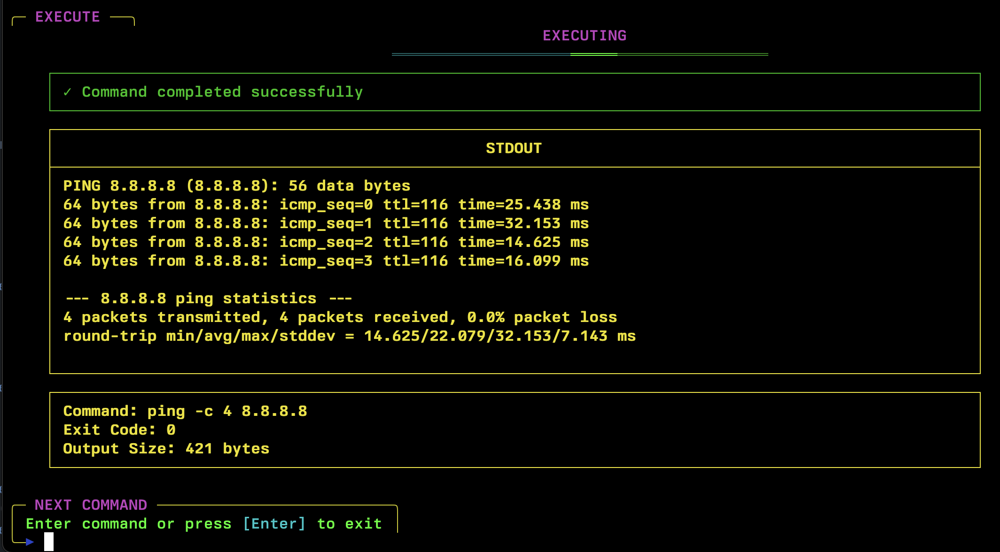
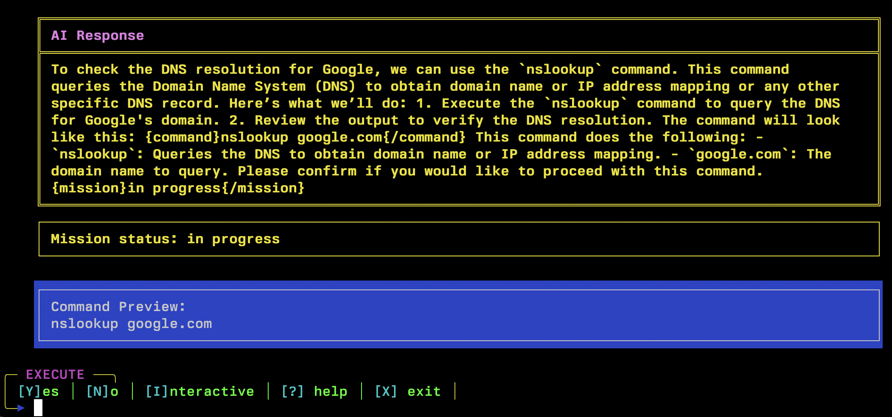
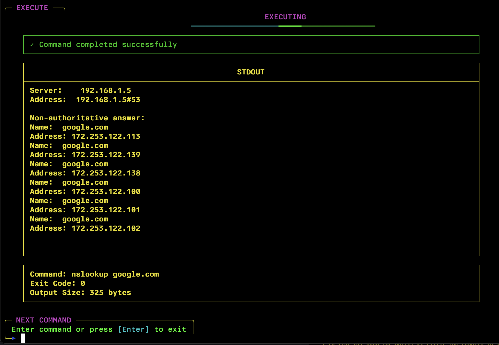

# Make It So 🖖

A command-line interface for the Make It So agent.  This is a free alpha release. If you have any feedback, please let me know!

Make it So allows for you to issue orders to your computer. The idea was to make a textual interface resebmling how you would interact with the main computer on the Star Trek series.

## Installs on Your Machine in Seconds ⚡

### Apple Silicon (M1/M2/M3/M4/M?) 🍎

Copy paste the following into your terminal:

```
curl -L https://raw.githubusercontent.com/RamboRogers/mis/master/install_mis.sh | sh
```

Now you can run `mis` from anywhere on your machine.

```
mis show my listening tcp ports
```

or

```
mis using ffmpeg convert video.mp4 to video.gif
```

Miss makes complicated tasks easy. Skip the manpages and just get it done. 🚀

### Linux Installation 🐧

Copy paste the following into your terminal:

```
curl -L https://raw.githubusercontent.com/RamboRogers/mis/master/install_mis_linux.sh | sh
```

### Configuration 🔧

Mis self configures on first run, but you can re-run the configuration at any time.

To re-run the configuration, use the `-r` flag.
```
mis -r
```

To change the AI provider, use the `-m` flag.

```
mis -m
```

### Works with OpenAI/Mistral/Groq/X.ai/Ollama 🤖



### Use Cases 💡

I'm on a Mac here, will this know the right command to use?


Of course it does.


Are we online?


Yea we are.


Let check if we're online.


Looking up DNS records.


Yes it bridges the gap and knows the right command to use.


## License and Contact ⚖️

This project is provided as is.  I'm not responsible for any damage it may cause.  Use at your own risk.

### Connect With Me 🤝
- GitHub: [RamboRogers](https://github.com/RamboRogers)
- X/Twitter: [@rogerscissp](https://x.com/rogerscissp)
- Website: [matthewrogers.org](https://matthewrogers.org)

