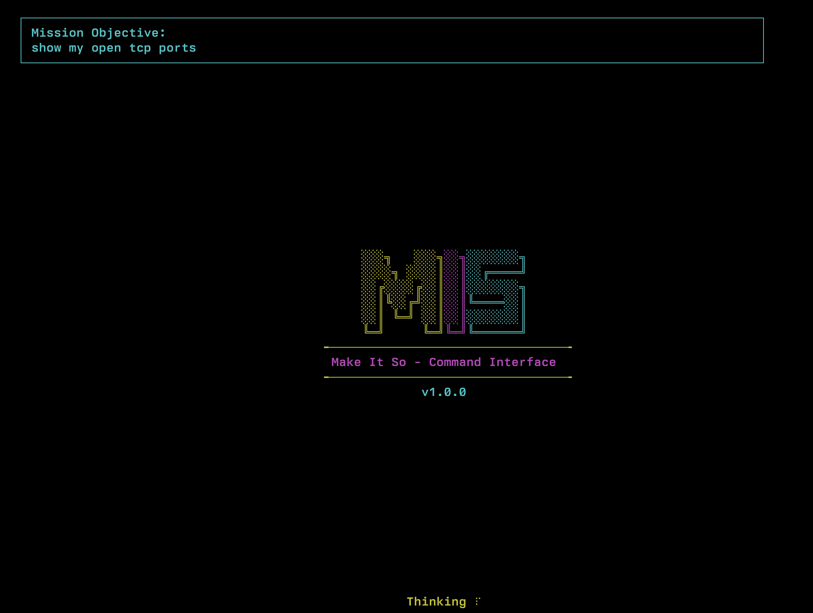

# Make It So

A command-line interface for the Make It So agent.

Install on your machine!

### Apple Silicon (M1/M2/M3)

Copy paste the following into your terminal:

```
curl -L https://raw.githubusercontent.com/RamboRogers/mis/master/install_mis.sh | sh
```

### Works with OpenAI/Mistral/Groq/X.ai/Ollama


### Use Cases

I'm on a Mac here, will this know the right command to use?


Of course it does.


Are we online?


Yea we are.


Let check if we're online.


Looking up DNS records.


Yes it bridges the gap and knows the right command to use.


