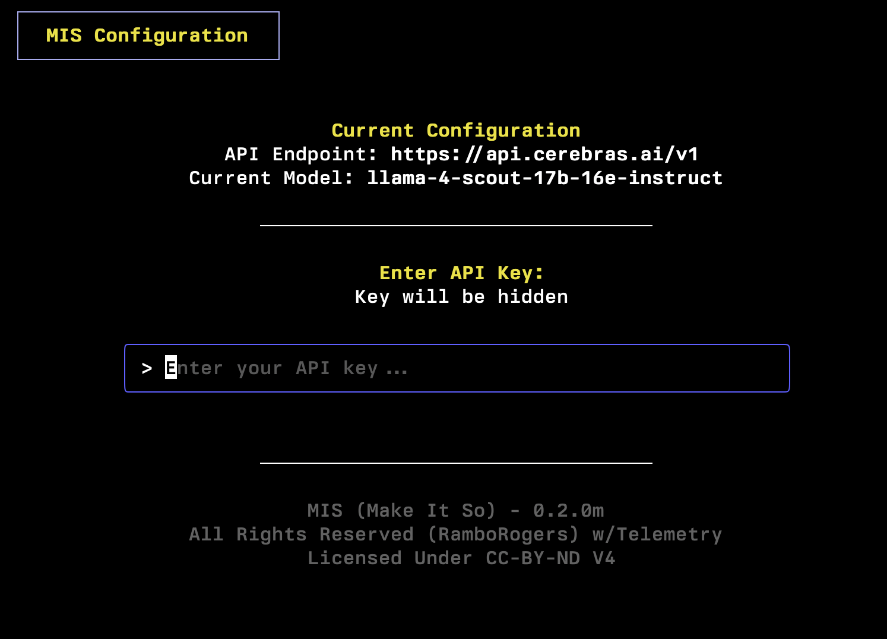

<div align="center">
  

  # 🖖 Make It So (MIS)

  <h3>Your AI-Powered Command Line Assistant</h3>

  [](https://opensource.org/licenses/MIT)
  []()
  []()

  <p>Issue natural language commands to your computer - like talking to the Star Trek computer. Rewritten in Go.  </p>

  <i>Get a free API key from <a href="https://cerebras.ai/">Cerebras.ai</a> to use with the Cerebras provider.</i>

<i>Note: Some models are good for **mis**, llama3 works well. Mistral is good, I've heard deepseek is good.</i>
</div>


## 🚀 Quick Install

### 🐧 Linux & 🍎 macOS

```bash
curl -L https://raw.githubusercontent.com/RamboRogers/mis/refs/heads/main/install.sh | sh
```

### 🪟 Windows PowerShell

```powershell
iwr -useb https://raw.githubusercontent.com/RamboRogers/mis/refs/heads/main/install_mis.ps1 | iex
```

### 🍺 macOS (Homebrew)

```bash
brew tap RamboRogers/mis
brew install mis
```

## Version 0.1.1m

- Added support for DeepSeek provider
- Homebrew install
- License changed to CC-BY-ND V4


## 📦 Version 0.1.0m

***Keep the issues and enhancement requests coming!***

- Added support for Cerebras provider
- Improved command parsing accuracy
- Enhanced system context awareness
- UI improvements for command review
- Better error handling and feedback


## Usage

Now you can run `mis` from anywhere on your machine:
```bash
# Configure MIS
mis -c

# Or jump right in
mis show my listening tcp ports
```

## ✨ Features

- 🤖 **Multi-Provider Support**: Works with OpenAI, Mistral, Groq, Cerebras, X.ai, and Ollama
- 🔍 **Context-Aware**: Understands your system and environment
- 🛠️ **Easy Configuration**: Simple setup with `-c` and `-m` flags
- 📝 **Natural Language**: Skip the man pages, just describe what you want
- 🔒 **Safe Execution**: Reviews commands with you before running


## 🎯 Example Use Cases

<details>
<summary>📊 System Analysis</summary>
<br/>

<br/>
<em>Natural language port analysis</em>
</details>

<details>
<summary>☸️ Kubernetes Management</summary>
<br/>

<br/>
<em>Simplified Kubernetes interactions</em>
</details>

<details>
<summary>📝 Command Output</summary>
<br/>

<br/>
<em>Clean, scrollable output display</em>
</details>

## 🔧 Configuration

```bash
# Initial configuration
mis -c

# Change AI provider
mis -m
```

<div align="center">
  
  <br/>
  <em>Simple Provider Configuration</em>
</div>


<div align="center">
  
  <br/>
  <em>Simple API Configuration</em>
</div>

## 📖 Examples

```bash
# System analysis
mis show my listening tcp ports

# Media conversion
mis using ffmpeg convert video.mp4 to video.gif

# Kubernetes operations
mis show me pods in namespace production
```

## ⚖️ License

This project is licensed under the MIT License. Use at your own risk.

<div align="center">

### Connect With Me 🤝

[](https://github.com/RamboRogers)
[](https://twitter.com/rogerscissp)
[](https://matthewrogers.org)


</div>